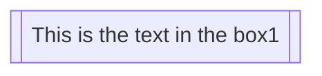
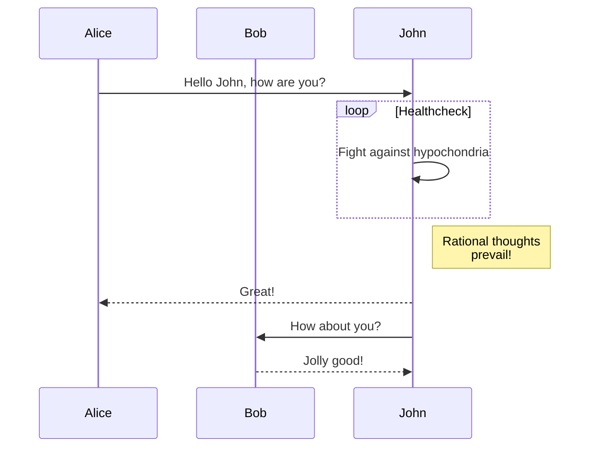

## LaTeX

Inline math equations go in like so: $\omega = d\phi / dt$. 
Display math should get its own line and be put in in double-dollarsigns:

$$I = \int \rho R^{2} dV$$

And note that you can backslash-escape any punctuation characters which you wish to be displayed literally, ex.: \`foo\`, \*bar\*, etc.

 
## Mermaid

Simple Flow Chart

Mermaid Graph

Sequence Diagram

